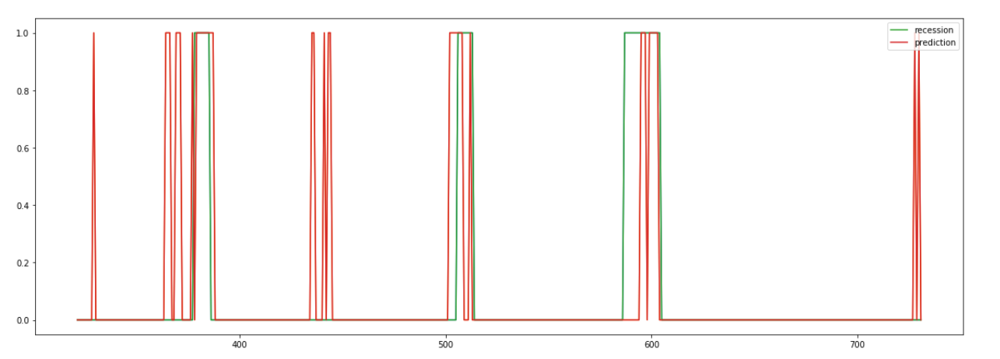

# Predicting Economic Recession with SVM

## Data Fetching

### Labels from NBER
This group of data is employed as labels of recession and expansion. Data fetched from https://www.nber.org/cycles/cyclesmain.html. Expansions are defined as the previous trough month (excluded) to the current peak month (included); recessions are defined as previous peak month (excluded) to the current trough month (included).

### Variable 1 of nonfarm payrolls
This group of variable stands for information from labor market. Data fetched from https://fred.stlouisfed.org/series/PAYEMS. It is the nonfarm payrolls from the Employment Situation Report published by the Bureau of Labor Statistics (BLS). Then take the log difference of it.

### Variable 2 of S&P500 monthly average
This group of variable stands for information from stock market. Data fetched from https://finance.yahoo.com/quote/%5EGSPC/history. It is the daily historical data of S&P500 from 1/1/1959 to 9/30/2019. Then we take a monthly average and then a log difference of it.

### Variable 3 of ISM Production Index
This group of variable stands for information from goods market. Data collected from https://www.instituteforsupplymanagement.org/ISMReport/MfgROB.cfm?SSO=1#production and https://ycharts.com/indicators/us_ism_manufacturing_production_index. It is published by ISM monthly.

### Variable 4 of 10-year Treasury yield minus the fed funds rate
This group of variable stands for information from bonds market.Data fetched from https://www.multpl.com/10-year-treasury-rate/table/by-month and https://fred.stlouisfed.org/series/FEDFUNDS. Then take difference of them.

## Data Cleaning
Convert labels from "trough month numbers" and "peak month numbers" to month numbers with recession and expension labels (1 for recession, 0 for expension). Discard the month number column.
Then take log-difference of variable 1 and log-difference monthly-average of variable 2. The after-processed 5 groups of data all contain only one column which is their value from Feburary 1959 to September 2019 (all 728 lines excluding title). Collabrate them into one single matrix (728 x 5, excluding column names) as input matrix.

## Parameter Tuning and Prediction

### Gamma and C from SVM
10-fold cross validation is utilized on the first 100 dates to determine hyper-parameters (gamma, C).

### Unbalanced Learning
Since the unbalanced proportion of recession and non-recession dates, tuned the punish-weights with 10-fold cross validation.

### Prediction
Expanding window is utlized for better performance comparing to rolling window.

## Forecasting a recession starting at Feburary 2020
### With a updated dataset of January 2020, this model predicts a economic recession at Feburary 2020.

